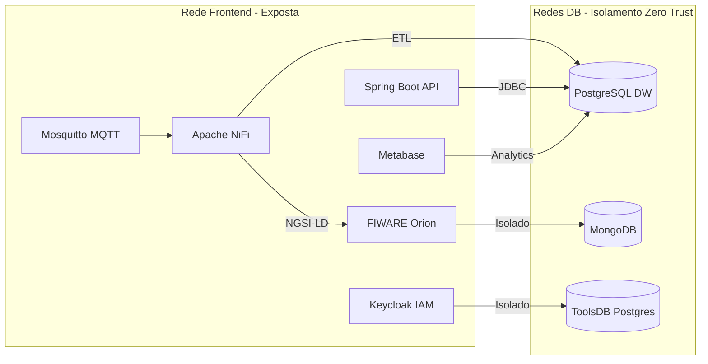

# 🚌 Plataforma de Gestão Urbana - Transportes Urbanos de Braga (TUB)


Este repositório contém o código-fonte e as simulações para a **Prova de Conceito (PoC)** da Plataforma de Gestão Urbana dos TUB, desenhada para a centralização, segurança e interoperabilidade de dados de mobilidade.

---

## 🎯 Visão Geral do Projeto

O objetivo primário da plataforma é agregar, monitorizar e gerir múltiplos sistemas operacionais dos TUB num único ponto de controlo. A arquitetura foi desenvolvida sobre o paradigma de **microsserviços** e alicerçada nos princípios de **Zero Trust Security**. Utiliza estritamente tecnologias *Open Source* e normas abertas (FIWARE, NGSI-LD).

---

## 🛠️ Arquitetura Tecnológica (Zero Trust)



| Componente | Tecnologia | Porta |
|---|---|---|
| Backend API | Spring Boot 4.0.3 (Java 21) | 8081 |
| Broker IoT | Eclipse Mosquitto 2.0 | 1883 |
| ETL / Orquestração | Apache NiFi | 8443 |
| Data Warehouse | PostgreSQL 15 + PostGIS | 5433 |
| Context Broker | FIWARE Orion | 1026 |
| Autenticação | Keycloak | 8080 |
| Dashboards | Metabase | 3000 |
| ETL Scheduler | Apache Airflow | 8082 |

---

## 🚀 Guia de Arranque da PoC

> A infraestrutura está já configurada e operacional no servidor Azure. Segue os passos abaixo **por esta ordem** para garantir que tudo funciona corretamente.

---

### PASSO 1 — (Opcional) Limpar dados de sessões anteriores

Se já existem dados de uma execução anterior e queres começar do zero:

**Limpar a Data Warehouse:**
```bash
docker exec -it datawarehouse psql -U pgu_dw_user -d pgu_datawarehouse \
  -c "TRUNCATE TABLE vehicle_telemetry RESTART IDENTITY;"
```

**Limpar entidades do Orion Context Broker:**
```bash
# Listar entidades existentes
curl http://localhost:1026/v2/entities | python -m json.tool

# Apagar uma entidade específica
curl -X DELETE http://localhost:1026/v2/entities/urn:ngsi-ld:Vehicle:bus001
```

---

### PASSO 2 — Abrir e Configurar o Apache NiFi

#### 2.1 Aceder ao NiFi
Abre o browser e navega para:
```
https://<ip-azure>:8443/nifi
```
As credenciais estão no ficheiro `.env` (`NIFI_USERNAME` / `NIFI_PASSWORD`).

> **Nota:** O browser vai mostrar um aviso de certificado auto-assinado — é esperado. Clica em "Avançar" / "Proceed anyway".

#### 2.2 Importar a configuração do Flow

1. No menu de cima, arrastar o Process Group para o canvas
2. Apertar do lado de colocar nome o upload button
3. Seleciona o ficheiro `pgu_ingestion_telemetry.json` da pasta `nifi-templates/` do repositório
4. Após o upload, ligar o Process Group clicando no play button

### PASSO 3 — Verificar o Backend e a Base de Dados

Antes de injetar dados, confirma que o Spring Boot está a correr e ligado à Data Warehouse:

```bash
# Ver logs do backend (deve mostrar "Started PguApplication")
docker compose logs --tail=20 spring-boot_backend

# Confirmar que a tabela existe e está vazia (ou com dados anteriores)
docker exec -it datawarehouse psql -U pgu_dw_user -d pgu_datawarehouse \
  -c "SELECT COUNT(*) FROM vehicle_telemetry;"
```

---

### PASSO 4 — Simular Telemetria de Autocarros

#### 4.1 Criar o ficheiro de mensagem dentro do container Mosquitto
```bash
docker exec -it mosquitto sh -c "printf '{\"id_veiculo\":\"bus001\",\"velocidade_atual\":45.2,\"lat\":41.5508,\"lon\":-8.4284,\"passageiros\":12,\"estado\":\"active\",\"timestamp_leitura\":\"2026-03-19T13:56:00Z\"}' > /tmp/msg.json"
```

#### 4.2 Publicar a mensagem no broker MQTT
```bash
docker exec -it mosquitto mosquitto_pub -t "raw/telemetry" -f /tmp/msg.json
```

Para simular múltiplos autocarros, repete os dois comandos alterando os valores:

```bash
# Bus 002 — em movimento com passageiros
docker exec -it mosquitto sh -c "printf '{\"id_veiculo\":\"bus002\",\"velocidade_atual\":32.0,\"lat\":41.5490,\"lon\":-8.4260,\"passageiros\":27,\"estado\":\"active\",\"timestamp_leitura\":\"2026-03-19T14:00:00Z\"}' > /tmp/msg.json"
docker exec -it mosquitto mosquitto_pub -t "raw/telemetry" -f /tmp/msg.json

# Bus 003 — parado numa paragem
docker exec -it mosquitto sh -c "printf '{\"id_veiculo\":\"bus003\",\"velocidade_atual\":0.0,\"lat\":41.5520,\"lon\":-8.4300,\"passageiros\":0,\"estado\":\"stopped\",\"timestamp_leitura\":\"2026-03-19T14:00:00Z\"}' > /tmp/msg.json"
docker exec -it mosquitto mosquitto_pub -t "raw/telemetry" -f /tmp/msg.json
```

---

### PASSO 5 — Verificar os Dados Recebidos

**Abra o Metabase:**
Abre o browser e navega para:
```
https://<ip-azure>:3000
Email: analista@tub.pt
Password: pgu123
```
Abrir a base de dados PGU Data Warehouse ir em public e verificar a tabela vehicle_telemetry 

**No Orion Context Broker (FIWARE):**
```bash
# Ver todas as entidades Vehicle
curl http://localhost:1026/v2/entities?type=Vehicle | python -m json.tool

# Ver entidade específica
curl http://localhost:1026/v2/entities/urn:ngsi-ld:Vehicle:bus001 | python -m json.tool
```

---

## 🌐 Acessos

Substitui `<ip-azure>` pelo IP público do servidor Azure.

| Serviço | URL | Credenciais |
|---|---|---|
| Apache NiFi | `https://<ip-azure>:8443/nifi` | Ver `.env` |
| Keycloak Admin | `http://<ip-azure>:8080` | Ver `.env` |
| Metabase | `http://<ip-azure>:3000` | Configurar no 1º acesso |
| Airflow | `http://<ip-azure>:8082` | Ver `.env` |
| Spring Boot API | `http://<ip-azure>:8081` | — |

---

## 🔧 Comandos de Manutenção

```bash
# Ver estado de todos os serviços
docker compose ps

# Ver logs de um serviço específico
docker compose logs -f <nome-do-serviço>
# Exemplos: mosquitto, nifi, datawarehouse, spring-boot_backend, orion

# Reiniciar um serviço específico
docker compose restart <nome-do-serviço>

# Parar toda a infraestrutura
docker compose down

# Atualizar e reconstruir após alterações de código
git pull origin main
docker compose up -d --build spring-boot_backend
```

---

*Projeto desenvolvido no âmbito da unidade curricular Desenvolvimento de Aplicações Informáticas (DAI).*