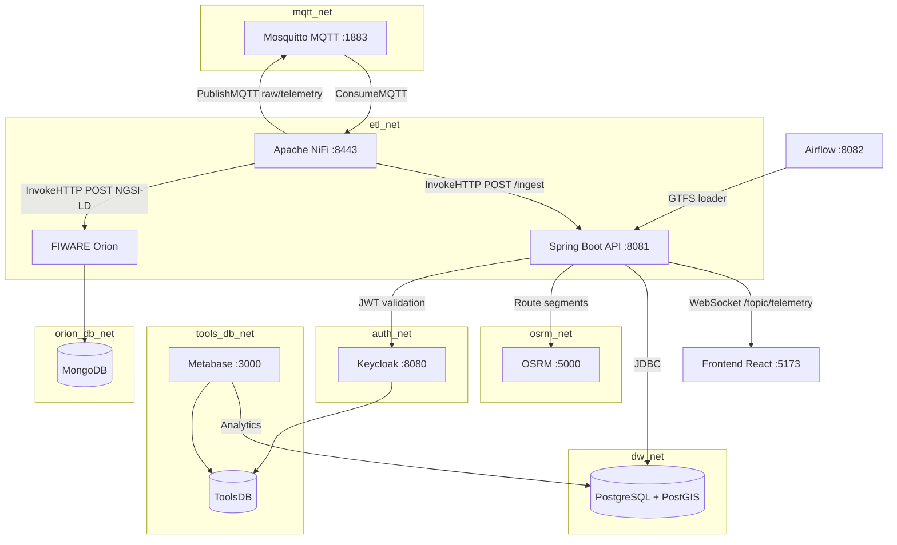

# Plataforma de Gestao Urbana - Transportes Urbanos de Braga (TUB)


Plataforma de centralizacao, monitorizacao e gestao de dados de mobilidade dos TUB, construida sobre microsservicos, principios Zero Trust e tecnologias Open Source (FIWARE, NGSI-LD).

---

## Arquitetura



### Fluxo de Dados

```
NiFi (ExecuteStreamCommand / Python)
  --> PublishMQTT (raw/telemetry)
    --> Mosquitto
      --> NiFi (ConsumeMQTT + ETL)
        --> Spring Boot (POST /api/v1/telemetry/ingest)
              |-> Guarda na Data Warehouse (PostgreSQL + PostGIS)
              |-> Broadcast WebSocket (/topic/telemetry) --> Frontend
        --> FIWARE Orion (InvokeHTTP / NGSI-LD)
              |-> MongoDB
```

### Stack Tecnologica

| Componente | Tecnologia | Porta | Rede |
|---|---|---|---|
| Backend API | Spring Boot 4.0.4 (Java 21) | 8081 | etl_net, dw_net, auth_net, osrm_net |
| Frontend (Backoffice + Livemap) | React 19 + Vite + Leaflet | 5173 | -- |
| Broker IoT | Eclipse Mosquitto 2.0 | 1883 | mqtt_net |
| ETL + Simulacao | Apache NiFi 2.4.0 | 8443 | mqtt_net, etl_net |
| Data Warehouse | PostgreSQL 15 + PostGIS 3.4 | 5433 (local) | dw_net |
| Context Broker | FIWARE Orion 3.9.0 | -- | etl_net, orion_db_net |
| Base de Dados Orion | MongoDB 6.0 | -- | orion_db_net |
| Autenticacao (IAM) | Keycloak 26.2.4 | 8080 | auth_net, tools_db_net |
| Dashboards | Metabase 0.52.4 | 3000 | tools_db_net, dw_net |
| BD Ferramentas | PostgreSQL 15 | -- | tools_db_net |
| Routing Engine | OSRM (self-hosted, Portugal) | 5000 | osrm_net |
| ETL Scheduler | Apache Airflow 2.10 | 8082 | etl_net |
| Simulador | Python (montado no NiFi) | -- | mqtt_net, etl_net |

### Micro-Segmentacao de Redes (Zero Trust)

| Rede | Funcao | Servicos |
|---|---|---|
| `mqtt_net` | Comunicacao MQTT | Mosquitto, NiFi |
| `etl_net` | Entrega de dados ETL | NiFi, Spring Boot, Orion |
| `dw_net` | Acesso a Data Warehouse | Spring Boot, PostgreSQL/PostGIS, Metabase |
| `orion_db_net` | Isolamento do Context Broker | Orion, MongoDB |
| `tools_db_net` | BD partilhada de ferramentas | Keycloak, Metabase, ToolsDB |
| `auth_net` | Validacao JWT | Spring Boot, Keycloak |
| `osrm_net` | Routing de segmentos | Spring Boot, OSRM |

---

## Pre-requisitos

- Docker e Docker Compose
- Ficheiro `.env` configurado na raiz do projeto (ver `.env.example`)

---

## Arranque

```bash
# Arrancar toda a infraestrutura
docker compose up -d

# Verificar estado dos servicos
docker compose ps

# Ver logs do backend
docker compose logs -f spring-boot_backend
```

---

## Guia de Utilizacao

### 1. Configurar o Apache NiFi

1. Aceder a `https://<ip>:8443/nifi` (credenciais no `.env`)
2. Importar o Process Group a partir de `nifi-templates/pgu_ingestion_telemetry.json`
3. Iniciar o Process Group (play)

> O browser mostra aviso de certificado auto-assinado -- e esperado.

### 2. Verificar a Ingestao de Dados

```bash
# Confirmar que a tabela tem dados
docker exec -it datawarehouse psql -U pgu_dw_user -d pgu_datawarehouse \
  -c "SELECT COUNT(*) FROM vehicle_telemetry;"

# Ver entidades no FIWARE Orion
curl http://localhost:1026/v2/entities?type=Vehicle | python -m json.tool
```

### 3. Dashboards

Aceder ao Metabase em `http://<ip>:3000` e configurar a ligacao a Data Warehouse na primeira utilizacao.

---

## API REST

| Metodo | Endpoint | Auth | Descricao |
|---|---|---|---|
| `GET` | `/api/v1/telemetry` | JWT | Obter telemetria historica |
| `GET` | `/api/v1/telemetry/latest` | JWT | Ultima telemetria por autocarro |
| `POST` | `/api/v1/telemetry/ingest` | Interno (NiFi) | Ingestao de dados transformados |
| `GET/POST` | `/api/v1/stops` | JWT | CRUD de paragens |
| `GET/POST` | `/api/v1/routes` | JWT | CRUD de rotas (calcula segmentos OSRM automaticamente) |
| `GET` | `/api/v1/route-segments/route/{id}` | JWT | Segmentos OSRM de uma rota |
| `GET/POST` | `/api/v1/buses` | JWT | CRUD de autocarros |
| `PUT` | `/api/v1/buses/{id}/activate` | JWT | Ativar autocarro |
| `PUT` | `/api/v1/buses/{id}/stop` | JWT | Parar autocarro (STOPPING -> STOPPED) |

### WebSocket (Tempo Real)

| Endpoint | Topico STOMP | Descricao |
|---|---|---|
| `/ws-telemetry` | `/topic/telemetry` | Stream de telemetria em tempo real |

---

## Migracoes de Base de Dados

O schema da Data Warehouse e gerido pelo **Flyway**. As migracoes estao em:

```
pgu/src/main/resources/db/migration/
  V1__create_vehicle_telemetry.sql
```

O Flyway executa automaticamente ao arrancar o Spring Boot. Para adicionar alteracoes ao schema, criar um novo ficheiro `V2__descricao.sql`.

---

## Estrutura do Projeto

```
DAI/
|-- docker-compose.yml          # Orquestracao de todos os servicos
|-- .env                        # Variaveis de ambiente (credenciais)
|-- mosquitto/config/           # Configuracao do Mosquitto
|-- postgres-init/              # Scripts de inicializacao da BD de ferramentas
|-- nifi-templates/             # Templates de fluxos NiFi
|-- simulator/                  # Simulador Python de autocarros (montado no NiFi)
|   |-- simulator.py
|-- osrm/                       # OSRM self-hosted (routing engine)
|   |-- Dockerfile              # Multi-stage: download Portugal PBF + processamento
|-- airflow/                    # Apache Airflow (ETL scheduler)
|   |-- dags/                   # DAGs de orquestracao
|   |-- scripts/
|       |-- gtfs_loader.py      # Carrega paragens e rotas GTFS dos TUB
|-- pgu-web/                    # Frontend React (Backoffice + Livemap)
|   |-- src/
|       |-- pages/
|       |   |-- Livemap.jsx     # Mapa em tempo real (Leaflet + WebSocket)
|       |   |-- Buses.jsx       # Gestao de autocarros (backoffice)
|       |   |-- Routes.jsx      # Gestao de rotas
|       |   |-- Stops.jsx       # Gestao de paragens
|       |-- services/api.js     # Cliente HTTP (Axios)
|       |-- index.css           # Design system (CSS variables)
|-- pgu/                        # Backend Spring Boot
    |-- Dockerfile
    |-- pom.xml
    |-- src/main/java/dai/tub/pgu/
    |   |-- PguApplication.java
    |   |-- config/             # SecurityConfig, WebSocketConfig
    |   |-- controller/         # REST controllers (Telemetry, Stops, Routes, Buses)
    |   |-- service/            # Business logic (OsrmService, RouteService, etc.)
    |   |-- domain/             # Entidades JPA (Bus, Route, Stop, RouteSegment, etc.)
    |   |-- dto/                # DTOs (TelemetryDTO, BusDTO, RouteDTO, etc.)
    |   |-- mapper/             # Mappers (JSON -> DTO -> Entity)
    |   |-- repository/         # Repositorios JPA + queries espaciais
    |   |-- audit/              # AuditAspect + LogActivity (auditoria AOP)
    |-- src/main/resources/
        |-- application.properties
        |-- db/migration/       # Migracoes Flyway
```

---

## Acessos

Substituir `<ip>` pelo IP publico do servidor Azure.

| Servico | URL | Credenciais |
|---|---|---|
| Frontend (Backoffice + Livemap) | `http://<ip>:5173` | JWT via Keycloak |
| Spring Boot API | `http://<ip>:8081` | JWT via Keycloak |
| Apache NiFi | `https://<ip>:8443/nifi` | `.env` |
| Apache Airflow | `http://<ip>:8082` | `.env` |
| Keycloak Admin | `http://<ip>:8080` | `.env` |
| Metabase | `http://<ip>:3000` | Configurar no 1o acesso |
| OSRM API | `http://<ip>:5000` | Sem autenticacao |

---

## Frontend — Livemap

O Livemap (`/livemap`) mostra em tempo real:

- **Paragens** como marcadores circulares no mapa (Leaflet)
- **Rotas** como polylines que seguem estradas reais (segmentos OSRM)
- **Autocarros** com posicao atualizada via WebSocket (STOMP)
- **Estados dos autocarros**:
  - `Em Viagem` (verde) — autocarro em movimento
  - `Em Paragem` (roxo) — parado numa paragem
  - `A Parar` (amarelo) — a terminar rota (STOPPING)
  - `Desativado` (cinza) — parado pelo gestor no backoffice (STOPPED)

O estado do autocarro cruza informacao do backend (`ACTIVE`/`STOPPING`/`STOPPED`) com a telemetria em tempo real (`active`/`stopped`).

---

## Carga de Dados GTFS

O Airflow executa o `gtfs_loader.py` que:

1. Faz download dos dados GTFS dos TUB (`tub.zip`)
2. Cria paragens via `POST /api/v1/stops`
3. Cria rotas com paragens ordenadas via `POST /api/v1/routes`
4. O Spring Boot calcula automaticamente os segmentos OSRM entre paragens (async)

---

## Comandos Uteis

```bash
# Estado dos servicos
docker compose ps

# Logs de um servico
docker compose logs -f <servico>

# Reiniciar um servico
docker compose restart <servico>

# Parar tudo
docker compose down

# Reconstruir apos alteracoes de codigo
docker compose up -d --build spring-boot_backend

# Limpar dados da Data Warehouse
docker exec -it datawarehouse psql -U pgu_dw_user -d pgu_datawarehouse \
  -c "TRUNCATE TABLE vehicle_telemetry RESTART IDENTITY;"
```

---

*Projeto desenvolvido no ambito da unidade curricular Desenvolvimento de Aplicacoes Informaticas (DAI).*
