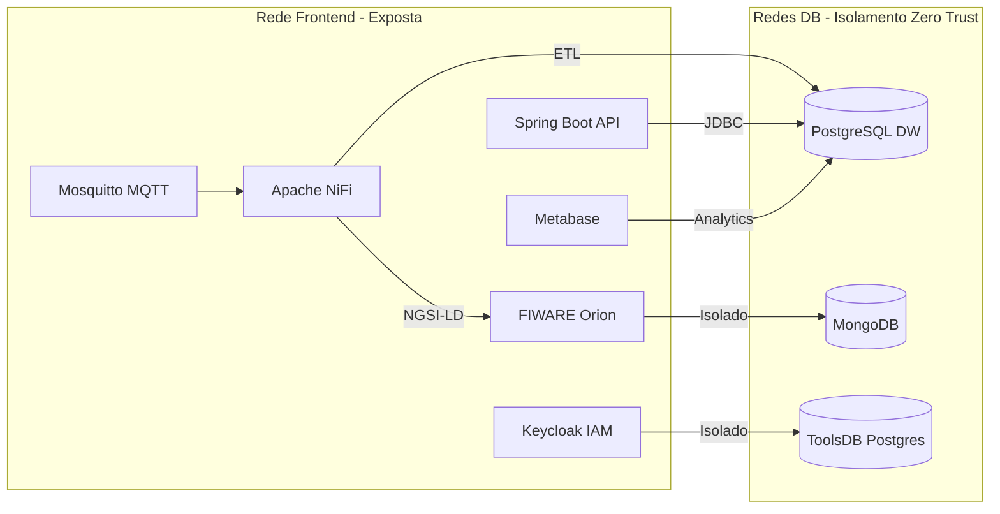

# 🚌 Plataforma de Gestão Urbana - Transportes Urbanos de Braga (TUB)


Este repositório contém o código-fonte e as simulações para a **Prova de Conceito (PoC)** da Plataforma de Gestão Urbana dos TUB, desenhada para a centralização, segurança e interoperabilidade de dados de mobilidade.

---

## 🎯 Visão Geral do Projeto

O objetivo primário da plataforma é agregar, monitorizar e gerir múltiplos sistemas operacionais dos TUB num único ponto de controlo. A arquitetura foi desenvolvida sobre o paradigma de **microsserviços** e alicerçada nos princípios de **Zero Trust Security**. Utiliza estritamente tecnologias *Open Source* e normas abertas (FIWARE, NGSI-LD).

## 🛠️ Arquitetura Tecnológica (Zero Trust)

A infraestrutura foi concebida com um isolamento de redes estrito entre a camada exposta e as bases de dados.



* **Backend:** Spring Boot (Java 21) com Spring Integration MQTT e Spring Data JPA.
* **Motor de Dados & ETL:** Apache NiFi.
* **Ingestão IoT:** Eclipse Mosquitto (Broker MQTT).
* **Data Warehouse:** PostgreSQL 15 com extensão espacial PostGIS.
* **Autenticação & SSO:** Keycloak (Suporte a OpenID Connect e OAuth 2.0).
* **Gestão de Contexto:** FIWARE Orion Context Broker e MongoDB.
* **Analítica & Dashboards:** Metabase.
* **Orquestração:** Docker e Docker Compose com múltiplas redes internas isoladas.

---

## 🚀 Como Executar o Projeto

### Pré-requisitos
* Git
* Docker e Docker Compose
* Java 21+ e Maven (para correr o Backend)

### 1. Clonar o Repositório
```bash
git clone https://github.com/antosantosb/DAI.git
cd DAI
```

### 2. Configurar o Ambiente (.env)
Antes de iniciar a infraestrutura, repare que o ficheiro `docker-compose.yml` exige as variáveis para garantir a segurança.
Existe um ficheiro `.env` na raiz do projeto contendo as credenciais. Se estiver em produção, altere as senhas originais deste ficheiro.

### 3. Levantar a Infraestrutura Docker
Levante todas as bases de dados, brokers e ferramentas de apoio em background:
```bash
docker-compose up -d
```
> **Nota:** Aguarde alguns segundos. Alguns serviços estão configurados com *healthchecks* estritos e só arrancarão quando o PostgreSQL e o MongoDB estiverem totalmente prontos.

### 4. Executar o Backend (Spring Boot)
O projeto Back-End está disponível na diretoria `pgu`. Pode ser aberto no seu IDE preferido (VS Code, IntelliJ, Eclipse) ou compilado via terminal:
```bash
cd pgu
mvn spring-boot:run
```

---
*Projeto desenvolvido no âmbito da unidade curricular Desenvolvimento de Aplicações Informáticas (DAI).*
