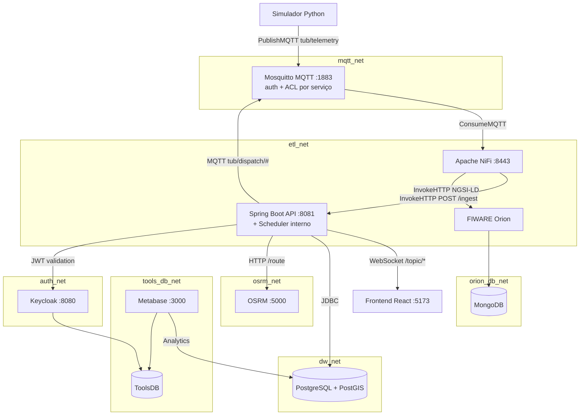

# PGU-TUB: Plataforma de Gestão Urbana dos Transportes Urbanos de Braga


Plataforma de centralização, monitorização e gestão de dados de mobilidade dos **Transportes Urbanos de Braga (TUB)**, construída sobre microsserviços, princípios **Zero Trust** e tecnologias **Open Source** (FIWARE, NGSI-LD, OSRM, Mosquitto, Keycloak).

---

## Índice

1. [Arquitetura](#arquitetura)
2. [Pré-requisitos](#pré-requisitos)
3. [Arranque rápido](#arranque-rápido)
4. [Acessos e credenciais](#acessos-e-credenciais)
5. [Frontend](#frontend)
6. [API REST](#api-rest)
7. [WebSocket (tempo real)](#websocket-tempo-real)
8. [Tratamento de erros](#tratamento-de-erros)
9. [Migrações Flyway](#migrações-flyway)
10. [Estrutura do projeto](#estrutura-do-projeto)
11. [Comandos úteis](#comandos-úteis)

---

## Arquitetura


```mermaid
flowchart TB
    subgraph mqtt_net [mqtt_net]
        MQ[Mosquitto MQTT :1883<br/>auth + ACL por serviço]
    end

    subgraph etl_net [etl_net]
        NF[Apache NiFi :8443]
        OR[FIWARE Orion]
        API[Spring Boot API :8081<br/>+ Scheduler interno]
    end

    subgraph dw_net [dw_net]
        DW[(PostgreSQL + PostGIS)]
    end

    subgraph orion_db_net [orion_db_net]
        MDB[(MongoDB)]
    end

    subgraph auth_net [auth_net]
        KC[Keycloak :8080]
    end

    subgraph tools_db_net [tools_db_net]
        TDB[(ToolsDB)]
        MB[Metabase :3000]
    end

    subgraph osrm_net [osrm_net]
        OSRM[OSRM :5000]
    end

    SIM[Simulador Python] -->|PublishMQTT tub/telemetry| MQ
    MQ -->|ConsumeMQTT| NF
    NF -->|InvokeHTTP POST /ingest| API
    NF -->|InvokeHTTP NGSI-LD| OR
    API -->|MQTT tub/dispatch/#| MQ
    API -->|WebSocket /topic/*| FE[Frontend React :5173]
    API -->|JDBC| DW
    API -->|HTTP /route| OSRM
    MB -->|Analytics| DW
    OR --> MDB
    KC --> TDB
    MB --> TDB
    API -->|JWT validation| KC
```

### Fluxo de dados

```
Simulador (Python)
    └─ PublishMQTT (tub/telemetry)
         └─ Mosquitto
              └─ ConsumeMQTT
                   └─ Apache NiFi
                        ├─ InvokeHTTP POST /api/v1/telemetry/ingest
                        │     └─ Spring Boot API
                        │          ├─ JDBC → PostgreSQL/PostGIS
                        │          ├─ WebSocket STOMP → /topic/telemetry → Frontend
                        │          └─ MQTT tub/dispatch/# → Painel de Bordo
                        └─ InvokeHTTP NGSI-LD
                              └─ FIWARE Orion → MongoDB
```

### Stack tecnológica

| Componente | Tecnologia | Porta | Redes |
|---|---|---|---|
| Backend API | Spring Boot 4.0.5 (Java 21) | 8081 | etl_net, dw_net, auth_net, osrm_net, mqtt_net |
| Frontend | React 19 + Vite + Leaflet + Keycloak-JS | 5173 | (público) |
| Broker IoT | Eclipse Mosquitto 2.0 (auth + ACL) | 1883 | mqtt_net |
| ETL | Apache NiFi 2.0.0 | 8443 | mqtt_net, etl_net |
| Data Warehouse | PostgreSQL 15 + PostGIS 3.4 | 5433 (local) | dw_net |
| Context Broker | FIWARE Orion 3.9.0 | (interna) | etl_net, orion_db_net |
| BD do Orion | MongoDB 6.0 | (interna) | orion_db_net |
| IAM | Keycloak 26.2.4 | 8080 | auth_net, tools_db_net |
| Dashboards | Metabase 0.52.4 | 3000 | tools_db_net, dw_net |
| BD de ferramentas | PostgreSQL 15 | (interna) | tools_db_net |
| Routing | OSRM self-hosted (Portugal) | 5000 | osrm_net |
| Simulador | Python (volume no NiFi) | (interna) | mqtt_net |
| Reverse proxy / TLS | Nginx + Let's Encrypt (prod) | 80, 443 | edge |

> **Nota:** o Apache Airflow foi removido por decisão arquitetural. O agendamento é feito por **Spring Scheduler** interno ao backend.

### Micro-segmentação de redes (Zero Trust)

| Rede | Função | Serviços |
|---|---|---|
| `mqtt_net` | Comunicação MQTT | Mosquitto, NiFi, Spring Boot, Simulador |
| `etl_net` | Entrega de dados ETL | NiFi, Spring Boot, Orion |
| `dw_net` | Acesso à Data Warehouse | Spring Boot, PostgreSQL/PostGIS, Metabase |
| `orion_db_net` | Isolamento do Context Broker | Orion, MongoDB |
| `tools_db_net` | BD partilhada de ferramentas | Keycloak, Metabase, ToolsDB |
| `auth_net` | Validação JWT | Spring Boot, Keycloak |
| `osrm_net` | Routing de segmentos | Spring Boot, OSRM |

---

## Pré-requisitos

- **Docker** e **Docker Compose** v2+
- **Bash** (`pgu-setup.sh` corre em Linux, macOS ou WSL)
- Ficheiro `.env` na raiz (gerado automaticamente pelo `pgu-setup.sh` em modo local)

---

## Arranque rápido

### Modo local (desenvolvimento)

```bash
# Gera .env, arranca toda a stack e faz health-check
./pgu-setup.sh
```

O script faz o seguinte:

1. Gera um `.env` com credenciais de desenvolvimento.
2. Executa `docker compose up -d --build`.
3. Aguarda que o Postgres, o Keycloak, o Mosquitto e a API fiquem saudáveis.
4. Imprime as URLs de acesso.

### Modo produção (Azure)

```bash
# Configurar .env a partir do exemplo
cp .env.example .env
# preencher DOMAIN, CERTBOT_EMAIL e todas as passwords

# Arrancar com perfil de produção (nginx + certbot + TLS)
docker compose --profile prod up -d
```

### Reset total

```bash
./pgu-setup.sh --nuke   # apaga volumes e reinicia do zero
```

---

## Acessos e credenciais

Substituir `<host>` por `localhost` (modo local) ou pelo domínio configurado em produção.

| Serviço | URL | Acesso |
|---|---|---|
| Frontend | `http://<host>:5173` | Login via Keycloak |
| Spring Boot API | `http://<host>:8081` | JWT via Keycloak |
| Apache NiFi | `https://<host>:8443/nifi` | `NIFI_USERNAME` / `NIFI_PASSWORD` (`.env`) |
| Keycloak Admin | `http://<host>:8080` | `IAM_ADMIN_USER` / `IAM_ADMIN_PASSWORD` (`.env`) |
| Metabase | `http://<host>:3000` | Configurar no 1.º acesso |
| OSRM API | `http://<host>:5000` | Público |
| FIWARE Orion | `http://<host>:1026/v2/entities` | Público (rede interna) |
| MinIO Console | `http://<host>:9001` | `MINIO_ROOT_USER` / `MINIO_ROOT_PASSWORD` (`.env`) |
| Mailpit (dev) | `http://<host>:8025` | Sem autenticação. Captura local de todos os emails. |

### Utilizadores do realm `pgu-realm`

Apenas o utilizador `admin` vem pré-criado em `keycloak/pgu-realm-realm.json`, com `temporary: true` e `requiredActions: ["UPDATE_PASSWORD"]`. **A password tem de ser alterada no primeiro login.**

| Username | Password inicial | Role | Destino |
|---|---|---|---|
| `admin` | `admin123` | `admin` | Backoffice (acesso total) |

As contas de **operadores** e **motoristas** são criadas pelo admin a partir do backoffice:

- `/backoffice/users`: gestão de operadores (atribui role `operador`).
- `/backoffice/drivers`: gestão de motoristas (atribui role `motorista` e o autocarro a que ficam associados).

As roles `operador` e `motorista` continuam definidas no realm e prontas a ser atribuídas.

### Email (SMTP)

A plataforma envia emails em duas situações: alertas críticos (fonte de dados em estado `DOWN`, ocorrências) e reports de problema iniciados pelo utilizador a partir da página *Fontes*.

| Ambiente | Servidor SMTP | Onde aparecem os emails |
|---|---|---|
| **Dev (local)** | **Mailpit** (`mailpit:1025`, dentro do `docker compose`) | `http://localhost:8025` (web UI do Mailpit, sem autenticação). Nenhum email sai para destinos reais. |
| **Produção** | Servidor SMTP real (Gmail, SendGrid, AWS SES, …) | Caixa de entrada do destinatário. |

O `pgu-setup.sh` em modo local já configura `SMTP_HOST=mailpit` no `.env`. Para passar a produção, basta editar o `.env` e substituir o bloco SMTP por uma das opções comentadas em `.env.example`:

```env
# Gmail (precisa de 2FA + App Password)
SMTP_HOST=smtp.gmail.com
SMTP_PORT=587
SMTP_USERNAME=sistema@tub.pt
SMTP_PASSWORD=xxxx-xxxx-xxxx-xxxx
SMTP_AUTH=true
SMTP_STARTTLS=true
```

> **Nota:** o backend só consegue enviar emails se o `SMTP_HOST` resolver. Se ficar a apontar para `mailpit` em produção (sem o container), as chamadas falham com timeout. O log do backend mostra a falha; o utilizador vê um toast de erro.

---

## Frontend

### Rotas principais

| Rota | Acesso | Descrição |
|---|---|---|
| `/` | Público | Landing page (apresentação) |
| `/livemap` | Autenticado | Mapa em tempo real (Leaflet + STOMP) |
| `/backoffice` | `admin`, `operador` | Dashboard de gestão |
| `/backoffice/buses` | `admin`, `operador` | CRUD de autocarros e chat de despacho |
| `/backoffice/routes` | `admin`, `operador` | CRUD de rotas (recalcula segmentos OSRM) |
| `/backoffice/stops` | `admin`, `operador` | CRUD de paragens |
| `/backoffice/drivers` | `admin` | Gestão de motoristas (Keycloak Admin API) |
| `/backoffice/users` | `admin` | Gestão de utilizadores |
| `/backoffice/exports` | `admin`, `operador` | Exportações CSV / JSON |
| `/bordo` | `motorista` | **Painel de Bordo** (auto-deteta o autocarro atribuído) |

### LiveMap

- **Paragens:** marcadores circulares (Leaflet).
- **Rotas:** polylines com os segmentos OSRM por estrada real.
- **Autocarros:** posição atualizada via WebSocket STOMP.
- **Estados:** cruzam `Bus.status` (`ACTIVE` / `STOPPING` / `STOPPED`) com a telemetria mais recente:
  - 🟢 **Em viagem:** em movimento.
  - 🟣 **Em paragem:** parado numa paragem.
  - 🟡 **A parar:** estado `STOPPING`.
  - ⚫ **Desativado:** estado `STOPPED`.

### Painel de Bordo

Interface dedicada ao motorista, em `/bordo`:

- Auto-deteta o autocarro atribuído via `GET /api/v1/drivers/me/bus`.
- Recebe mensagens do operador em tempo real (`/topic/despacho/{busId}`).
- Permite reportar avarias (`POST /api/v1/ocorrencias/motorista`).
- Mostra notificações *toast* e *badge* de mensagens por ler.

---

## API REST

### Endpoints principais

| Método | Endpoint | Roles | Descrição |
|---|---|---|---|
| `GET` | `/api/v1/telemetry` | `admin`, `operador` | Telemetria histórica (paginada) |
| `GET` | `/api/v1/telemetry/latest` | `admin`, `operador` | Última telemetria por autocarro |
| `POST` | `/api/v1/telemetry/ingest` | Interno (API key) | Ingestão a partir do NiFi |
| `GET/POST` | `/api/v1/stops` | `admin`, `operador` | CRUD de paragens |
| `GET/POST` | `/api/v1/routes` | `admin`, `operador` | CRUD de rotas (calcula segmentos OSRM) |
| `GET` | `/api/v1/route-segments/route/{id}` | `admin`, `operador` | Segmentos OSRM de uma rota |
| `GET/POST` | `/api/v1/buses` | `admin`, `operador` | CRUD de autocarros |
| `PUT` | `/api/v1/buses/{id}/activate` | `admin`, `operador` | Ativa o autocarro |
| `PUT` | `/api/v1/buses/{id}/stop` | `admin`, `operador` | Marca como `STOPPING` |
| `GET` | `/api/v1/buses/{id}/health` | `admin`, `operador` | Dashboard de saúde |
| `GET/POST` | `/api/v1/drivers` | `admin` | Gestão de motoristas (via Keycloak) |
| `GET` | `/api/v1/drivers/me/bus` | `motorista` | Autocarro atribuído ao motorista autenticado |
| `GET/POST` | `/api/v1/ocorrencias` | `admin`, `operador` | Avarias e ocorrências |
| `POST` | `/api/v1/ocorrencias/motorista` | `motorista` | Motorista reporta avaria do seu autocarro |
| `GET/POST` | `/api/v1/despacho/{busId}/mensagens` | `admin`, `operador` | Chat de despacho (operador) |
| `GET/POST` | `/api/v1/despacho/{busId}/mensagens/motorista` | `motorista` | Chat de despacho (motorista) |
| `GET` | `/api/v1/alertas` | `admin`, `operador` | Alertas críticos |
| `GET` | `/actuator/health` | Público | Health-check |

Documentação OpenAPI interativa em `http://<host>:8081/swagger-ui.html` (apenas em modo `dev`).

---

## WebSocket (tempo real)

Endpoint STOMP: `ws://<host>:8081/ws-telemetry`. A **autenticação JWT é obrigatória** no frame `CONNECT` (header `Authorization: Bearer <token>`).

| Tópico | Audiência | Descrição |
|---|---|---|
| `/topic/telemetry` | `admin`, `operador` | Stream de telemetria |
| `/topic/despacho/{busId}` | `admin`, `operador`, `motorista` (do bus) | Mensagens de despacho do autocarro |
| `/topic/despacho/unread-update` | `motorista` | Atualização do contador de mensagens por ler |
| `/topic/alertas` | `admin`, `operador` | Alertas críticos em tempo real |
| `/topic/ocorrencias` | `admin`, `operador` | Novas ocorrências |

> O cliente STOMP do frontend (`pgu-web/src/services/stompClient.js`) renova o token antes de cada `CONNECT` (`keycloak.updateToken(30)`).

---

## Tratamento de erros

Todos os endpoints devolvem erros em formato JSON consistente (`GlobalExceptionHandler` + `ErrorResponse`):

```json
{
  "code": "VALIDATION",
  "message": "Pedido invalido",
  "timestamp": "2026-05-26T20:17:42Z",
  "path": "/api/v1/buses",
  "traceId": "8f2c1b4a-...",
  "fieldErrors": {
    "capacity": "must be greater than or equal to 1"
  }
}
```

Códigos possíveis: `VALIDATION`, `NOT_FOUND`, `FORBIDDEN`, `BUSINESS_RULE`, `UPLOAD_TOO_LARGE`, `INTERNAL`.

---

## Migrações Flyway

Localização: `pgu/src/main/resources/db/migration/`. As migrações executam automaticamente ao arrancar o Spring Boot.

| Versão | Descrição |
|---|---|
| `V1` | `vehicle_telemetry` (tabela principal de telemetria) |
| `V2` a `V10` | `stops`, `routes`, `buses`, `route_segments`, `route_stops` |
| `V11` a `V18` | `ocorrencias`, `alertas`, `dashboard_health` |
| `V19` a `V22` | `mensagens_despacho` (chat operador / motorista) |
| `V23` a `V26` | Auditoria (`audit_log`), índices PostGIS |
| `V27` | `lida_pelo_operador` em `mensagens_despacho` |
| `V28` | Índices compostos de performance (`bus_id`, `recorded_at`, etc.) |

---

## Estrutura do projeto

```
DAI/
├── docker-compose.yml              # Orquestração de todos os serviços
├── .env / .env.example             # Variáveis de ambiente
├── pgu-setup.sh                    # Bootstrap one-shot (--nuke disponível)
│
├── pgu/                            # Backend Spring Boot
│   ├── pom.xml
│   └── src/main/
│       ├── java/dai/tub/pgu/
│       │   ├── PguApplication.java
│       │   ├── config/             # SecurityConfig, WebSocketConfig,
│       │   │                       # WebSocketSecurityConfig, InternalApiKeyFilter,
│       │   │                       # GlobalExceptionHandler, JwtRoleConverter
│       │   ├── controller/         # TelemetryController, BusController,
│       │   │                       # DespachoController, DriverController, ...
│       │   ├── service/            # BusService, DespachoService, AlertaService,
│       │   │                       # KeycloakAdminService, MqttDespachoService, ...
│       │   ├── domain/             # Entidades JPA
│       │   ├── dto/                # DTOs e ErrorResponse
│       │   ├── repository/         # JPA + queries PostGIS
│       │   └── audit/              # AuditAspect (AOP)
│       └── resources/
│           ├── application.properties
│           ├── application-prod.properties
│           └── db/migration/       # Flyway V1 a V28
│
├── pgu-web/                        # Frontend React + Vite
│   ├── nginx.conf.template         # Reverse proxy e security headers (prod)
│   └── src/
│       ├── pages/
│       │   ├── Landing.jsx
│       │   ├── Livemap.jsx
│       │   ├── PainelBordo.jsx     # Painel do motorista
│       │   └── backoffice/         # Buses, Routes, Stops, Drivers, Users, Exports
│       ├── components/             # Modal (a11y), BusCard, BusDetailPanel, ...
│       └── services/
│           ├── api.js              # Axios + timeout + toasts globais
│           └── stompClient.js      # STOMP com refresh do JWT
│
├── keycloak/
│   └── pgu-realm-realm.json        # Realm, clients e users (temporary passwords)
│
├── mosquitto/config/
│   ├── mosquitto.conf              # allow_anonymous false
│   └── acl.conf                    # ACL por utilizador (backend, simulator, nifi, bus)
│
├── nifi-templates/                 # Process groups exportados
├── simulator/simulator.py          # Simulador MQTT (volume no NiFi)
├── osrm/Dockerfile                 # OSRM self-hosted (Portugal PBF)
└── postgres-init/init-tools.sql    # Inicialização das BDs Keycloak e Metabase
```

---

## Comandos úteis

```bash
# Estado dos serviços
docker compose ps

# Logs de um serviço
docker compose logs -f spring-boot_backend
docker compose logs -f mosquitto

# Reiniciar um serviço
docker compose restart spring-boot_backend

# Reconstruir após alterações de código
docker compose up -d --build spring-boot_backend

# Parar tudo
docker compose down

# Reset total (apaga volumes)
./pgu-setup.sh --nuke

# Confirmar telemetria na Data Warehouse
docker exec -it datawarehouse psql -U "$DW_USER" -d "$DW_NAME" \
  -c "SELECT COUNT(*) FROM vehicle_telemetry;"

# Health-check da API
curl -fsS http://localhost:8081/actuator/health | jq

# Entidades no FIWARE Orion
curl -fsS http://localhost:1026/v2/entities | jq
```

---

*Projeto desenvolvido no âmbito da unidade curricular **Desenvolvimento de Aplicações Informáticas (DAI)**, **Licenciatura em Engenharia e Gestão de Sistemas de Informação** da Universidade do Minho, ano letivo 2025/2026.*
